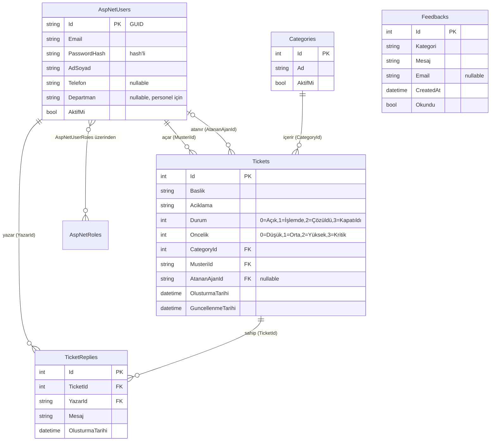

# HelpDesk — Veritabanı Şeması

**Motor:** SQLite · **Yaklaşım:** Entity Framework Core (Code-First) · **Üyelik:** ASP.NET Core Identity

Aşağıdaki diyagram GitHub'da ve VS Code'da (Mermaid eklentisiyle) görsel olarak render olur.

## ER Diyagramı

> Not: `Feedbacks` hiçbir tabloya bağlı değildir (bağımsız tablo) — üyelik gerektirmeyen genel geri bildirim formu içindir.

## Silme davranışları (Foreign Key `ON DELETE`)

| İlişki | Davranış | Anlamı |
|---|---|---|
| Ticket → Müşteri (MusteriId) | **RESTRICT** | Talebi olan müşteri silinemez |
| Ticket → Atanan Ajan (AtananAjanId) | **SET NULL** | Ajan silinirse talep "atanmamış" olur |
| Ticket → Kategori (CategoryId) | **CASCADE** | (DB) kategori silinirse talepleri de silinir — ancak uygulama, talebi olan kategorinin silinmesini engeller |
| TicketReply → Talep (TicketId) | **CASCADE** | Talep silinirse yanıtları da silinir |
| TicketReply → Yazar (YazarId) | **RESTRICT** | Yanıt yazan kullanıcı silinemez |

## Indexler
EF Core tüm yabancı anahtarlar için otomatik index oluşturur:
`IX_Tickets_CategoryId`, `IX_Tickets_MusteriId`, `IX_Tickets_AtananAjanId`,
`IX_TicketReplies_TicketId`, `IX_TicketReplies_YazarId`.

## Tablolar
**Domain tabloları (bizim):** `Tickets`, `TicketReplies`, `Categories`, `Feedbacks`
**Identity tabloları (otomatik):** `AspNetUsers`, `AspNetRoles`, `AspNetUserRoles`, `AspNetUserClaims`, `AspNetRoleClaims`, `AspNetUserLogins`, `AspNetUserTokens`

## İlk veriler (Seed)
DB ilk oluşturulduğunda otomatik eklenir:
- **Roller:** Admin, SupportAgent, Customer
- **Admin:** admin@helpdesk.com / Admin123!
- **Support:** support@helpdesk.com / Support123! (Departman: Teknik Destek)
- **Kategoriler:** Teknik Sorun, Fatura & Ödeme, Hesap & Erişim, Genel Bilgi Talebi, Diğer
